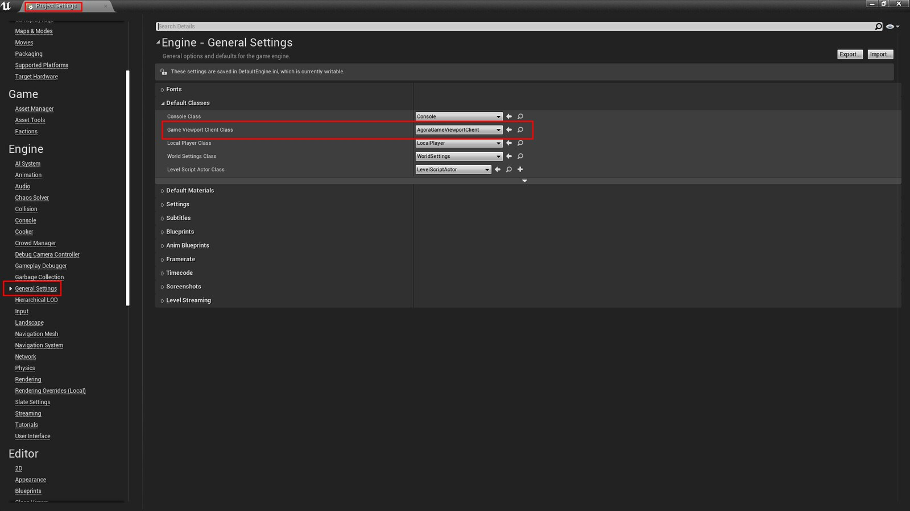
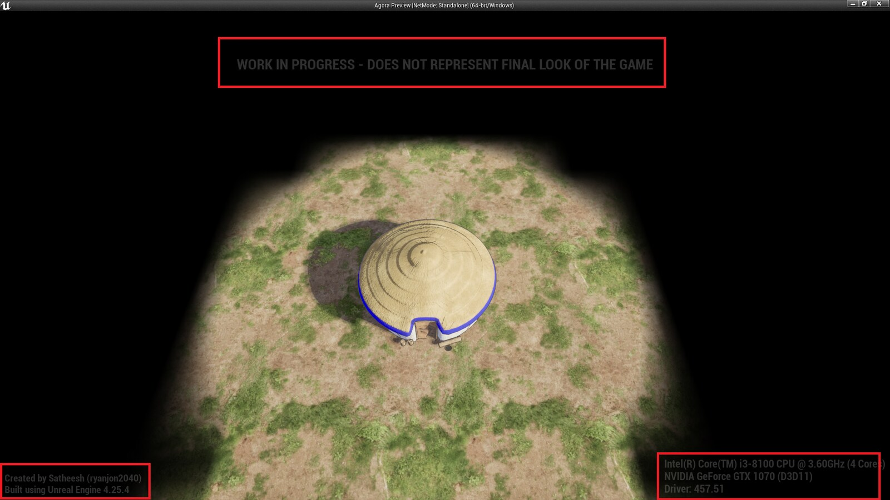
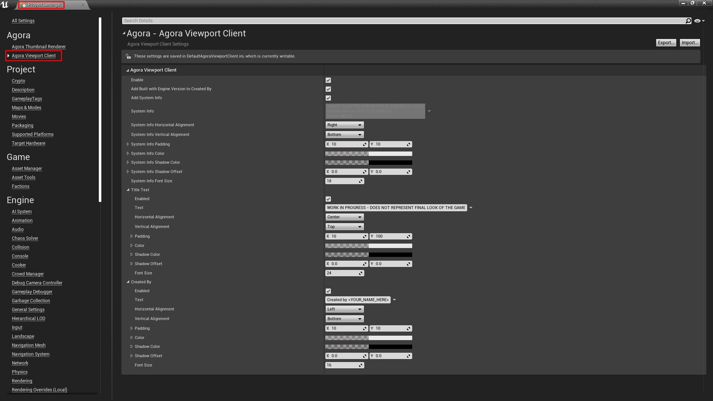

# AgoraViewportClient

 

 

A simple plugin that acts as an overlay watermark widget.

This repository hosts the source code for Agora Viewport Client which you can download for free and compile yourself. Precompiled binaries for the last three versions of Unreal Engine can be bought from Epic Marketplace: https://www.unrealengine.com/marketplace/agora-viewport-client

# How to use

After the plugin is enabled, restart Unreal Editor and assign `AgoraGameViewportClient` to Game Viewport Client Class from `Project Settings` -> `General Settings` section.

# Result

Settings can be adjusted from Project Settings

